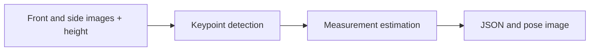

# Pose Detection API

A FastAPI service that estimates body keypoints and approximate measurements from front and side photographs plus a supplied height.

**Status:** Computer-vision API prototype  
**Tools:** Python · FastAPI · OpenCV DNN · NumPy · TensorFlow graph

## What this project does

- Accept multipart front_image, side_image, and height fields at POST /estimate-pose/.
- Load an OpenPose-style MobileNet graph through OpenCV DNN.
- Estimate measurement values and produce an annotated pose image.

## How it works



Front and side images + height → Keypoint detection → Measurement estimation → JSON and pose image

## Repository guide

- [`api.py`](api.py)
- [`api_request.py`](api_request.py)
- [`model/graph_opt.pb`](model/graph_opt.pb)
- [`model/README.md`](model/README.md)

## Setup and use

Install compatible FastAPI, Uvicorn, OpenCV, NumPy, and python-multipart dependencies in a fresh environment. Run from the repository root so the model path resolves:

```sh
python -m uvicorn api:app --reload
```

Edit the sample image paths and height in `api_request.py` before sending a request. FastAPI serves endpoint documentation at `/docs`.

## Current limits

The current implementation writes a shared output-image filename, so concurrent requests need output isolation before production use. Measurements depend on input pose, image geometry, and the supplied height. The model README documents the upstream OpenCV/tf-pose-estimation lineage.

## Portfolio

[Project details and related work](https://azka1212.github.io/Azka-AI-Developer/#projects)

> Documentation was checked against the repository source. Unless explicitly stated, setup commands describe the intended entry points and were not executed as part of this documentation update.
